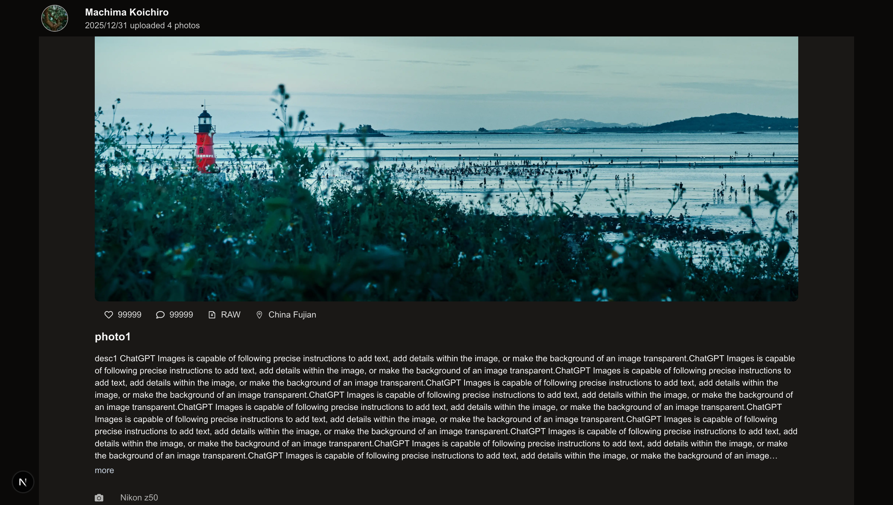
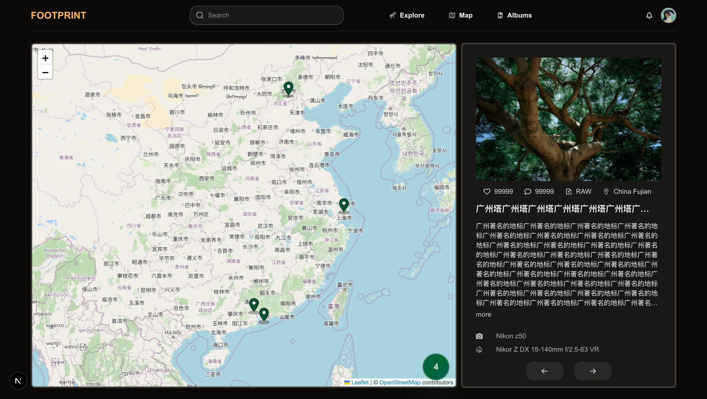
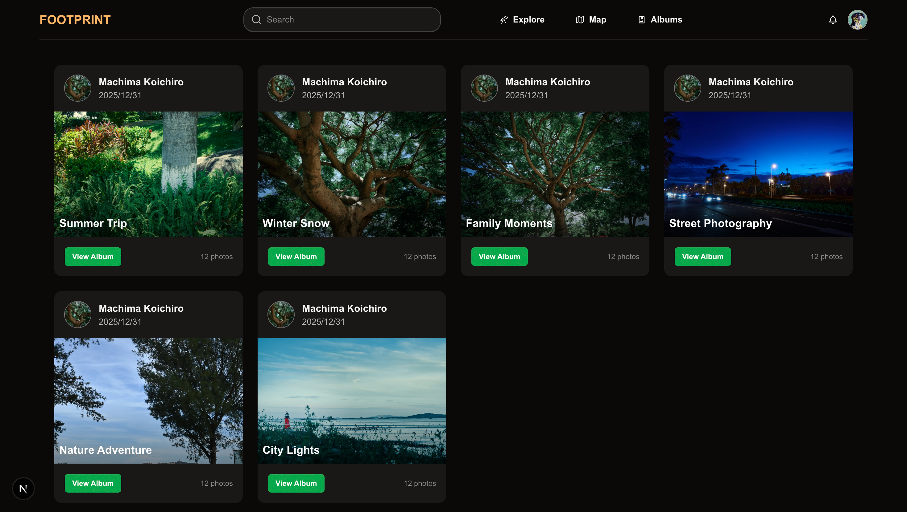
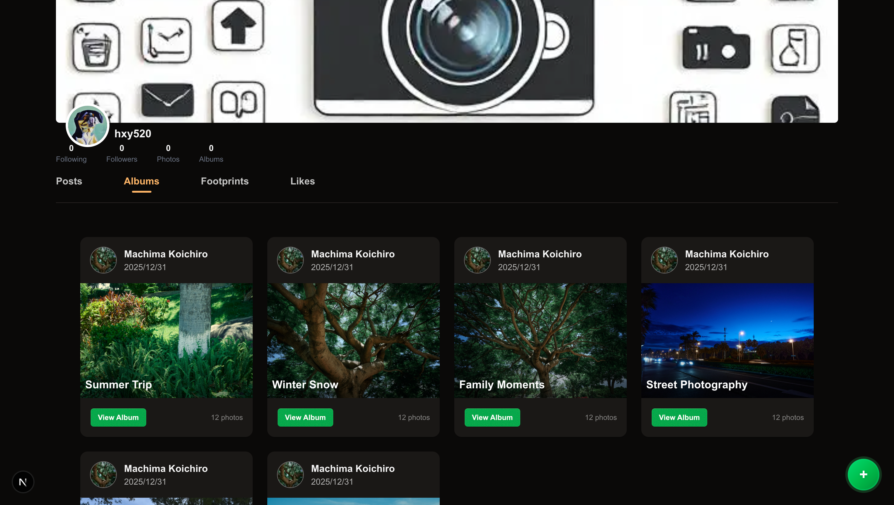

# 🌍 Footprint
[English](README.md)
[中文](README_ZH.md)

हमसे जुड़ें: 📮`72e1bcgg@gmail.com` Ma Haoran

**Footprint** एक हल्का सोशल प्लेटफ़ॉर्म है, जिसे **यात्रियों, फ़ोटोग्राफ़रों और आउटडोर एक्सप्लोरर्स** के लिए बनाया गया है।  
यहाँ आप फ़ोटो साझा कर सकते हैं, स्थान रिकॉर्ड कर सकते हैं, अपनी यात्रा की कहानियाँ बता सकते हैं, और दुनिया को प्यार करने वाले नए दोस्तों को खोज सकते हैं।

> 📸 कैमरा उठाइए, बैग पैक कीजिए, और अपनी "Footprint" दुनिया को दिखाइए।

------

## 🚀 टेक स्टैक

Next.js · Tailwind CSS · DaisyUI · Prisma · react-leaflet · Clerk

------

## ✨ फीचर्स

------

## 📸 1. यात्रा फ़ोटोग्राफ़ी पोस्ट करें और ब्राउज़ करें

फ़ोटो अपलोड करें, विवरण जोड़ें, लोकेशन लगाएँ — और यह आपकी एक “Footprint” बन जाती है।  
अगर आप प्रोफ़ेशनल फ़ोटोग्राफ़र हैं, तो आप **RAW फ़ाइलें** भी अपलोड कर सकते हैं, EXIF जानकारी दिखा सकते हैं, और उपयोगकर्ताओं को **RAW फ़ाइल पेड डाउनलोड** करने की अनुमति दे सकते हैं।

अन्य उपयोगकर्ता कर सकते हैं:

- 👍 लाइक  
- 💬 कमेंट  
- ⬇️ RAW डाउनलोड  
- 👤 आपका प्रोफ़ाइल देखें  

------

## 🗺️ 2. दुनिया भर के Footprints को नक्शे पर देखें

विश्व मानचित्र की मदद से आप दुनिया भर के यूज़र्स द्वारा छोड़े गए Footprints देख सकते हैं:  
कोई शहर, समुद्र तट, पहाड़… जानें वहाँ क्या कहानियाँ हुई थीं।

आप किसी भी उपयोगकर्ता की प्रोफ़ाइल खोलकर उनकी यात्रा और फ़ोटोग्राफ़ी लोकेशनों को देख सकते हैं।

------

## 🗂️ 3. फ़ोटो कलेक्शन / एल्बम

उपयोगकर्ता अपनी पसंद के थीम पर आधारित एल्बम बना सकते हैं, जैसे:

- स्ट्रीट फ़ोटोग्राफ़ी  
- पर्वत यात्रा  
- समुद्र तट  
- नाइट फ़ोटोग्राफ़ी  

इससे फ़ोटो बेहतर तरीके से व्यवस्थित और प्रदर्शित होती हैं।

------

## 🤝 4. AI आधारित इंटरेस्ट मैचिंग (डेवलपमेंट में)

AI आपको उन लोगों से जोड़ेगा जिनकी रुचियाँ आपके जैसी हों:

- शूट की गई लोकेशन  
- फोटो की सामग्री  
- यात्रा मार्ग  
- यात्रा पसंद  

ताकि यात्रा और फ़ोटोग्राफ़ी प्रेमी एक-दूसरे से आसानी से जुड़ सकें।

------

# 🧭 Join Us! / टीम में शामिल हों!

प्रोजेक्ट पर तेज़ी से काम चल रहा है।  
अगर आपको **यात्रा, फ़ोटोग्राफ़ी, सोशल प्लेटफ़ॉर्म, मैप्स या AI** में रुचि है — तो हमारे साथ मिलकर इसे बनाएँ!

हम ढूंढ रहे हैं:

- 🌟 फ्रंटएंड इंजीनियर्स (Next.js / React)  
- 🗺️ मैप / GIS डेवलपर्स (Leaflet / GIS)  
- 🧠 AI / कंप्यूटर विज़न इंजीनियर्स  
- 🎨 UI/UX डिज़ाइनर्स  

अगर आप एक ऐसा प्रोजेक्ट बनाना चाहते हैं जो सच में मज़ेदार, सार्थक हो और दुनिया भर के उपयोगकर्ताओं द्वारा देखा जाए — तो आप हमारे लिए बिल्कुल सही हैं।

📮`72e1bcgg@gmail.com` Ma Haoran
